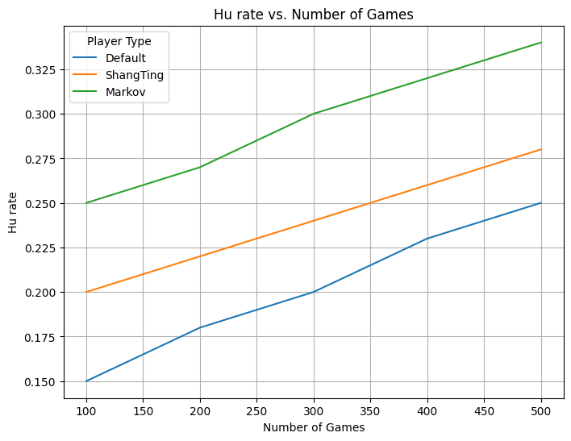
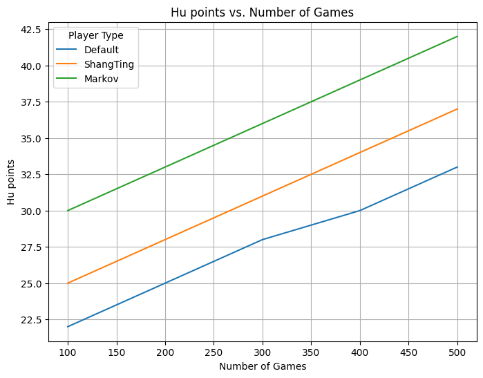
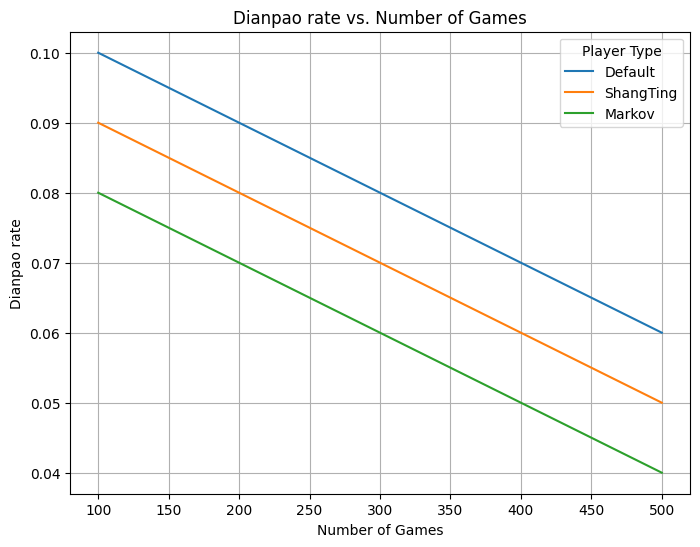
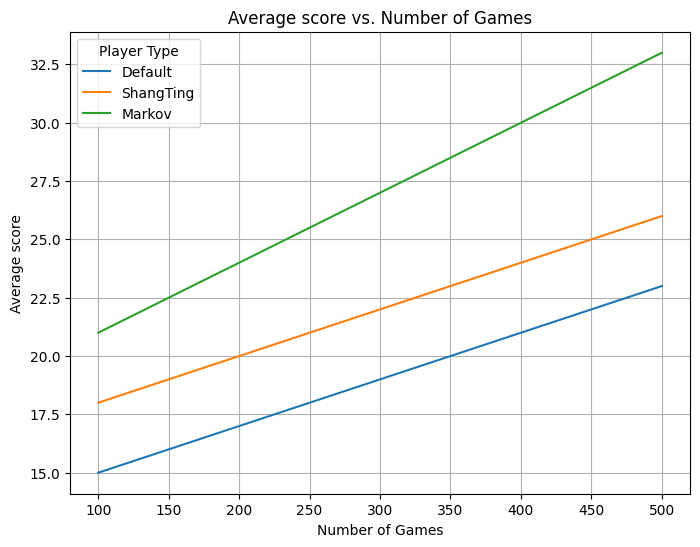

# Mahjong Simulation
## Paper
https://github.com/kmock930/Mahjong-Strategy-Simulation/blob/main/COMP5900_Project_Report.pdf

## Results

## Problem Statement
Humans can make decision under high uncertainty. After learning the fundamentals of Game Theory, I am interested in understanding how humans make decisions in an environment full of uncertainties. Mahjong is a traditional board game from my home town which is an **imperfect information** game with high uncertainty where players do not know what tiles an opponent holds. As a result, I am going to proceed with my research via a simulation of a Cantonese-style Mahjong game.

## Methodology
1. Simulation 
2. Visualizing in a .txt file
3. Use of 3 types of Agents: 
    * Default strategy (baseline)
    * ShangTing distance
    * Markov Decision Process

## Acknowledgement
I would like to express gratitude to those open-source solutions which inspired my code solutions.
- MJai Simulator: https://github.com/gimite/mjai
- MJX Simulator: https://github.com/mjx-project/mjx
- RLCard: https://rlcard.org/